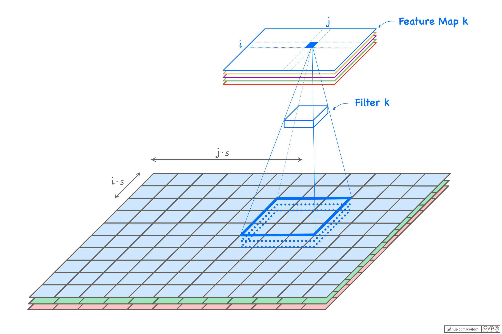

# Convolutional Layers
## A cell in a `Conv`-layer versus a `Dense`-layer 

### Dense
In a dense layer, a neuron is connected to **all input neurons**.

 

- The input neurons are arranged in a **vector**.
- The weights are also arranged in a vector.
    - The weight vector has the **same shape** as the input.
    - The  dot product between the input and the weights is calculated.

### Conv
In a conv layer, a neuron is connected only to the input neurons within its **receptive field**. In the example below, the receptive field is a 3x3 square area.

 

- The input neurons are arranged in a **multi-dimensional array**.
- The weights are also arranged in a multi-dimensional array (i.e. tensor), called a **filter**.
    - The weight tensor has the **same shape** as the receptive field. In particular, they have the **same number of channels** (which is one in this example).
    - The dot product between the weights tensor and the receptive field is calculated. This operation is also called **convolution** (denoted with a '*').

The filter is moved over the image, one pixel at a time, and its inner product with all 3x3 areas of the input is calculated. The result is a 3x4 matrix that is called a **feature map** (or an output channel). 

## Zero-Padding

If we want the output to have the same size as the input, we pad the image with zeros in such a way, that the dimensions match. We will see later, how the required number of padding rows and columnscan be calculated.

The padding rows and columns are distributed equally to the top and bottom, and to the left and right of the image. If the number is uneven, there can be a difference of one. 

 

## Stride

Stride is a **hyperparameter** that controls the **step size** at which the convolutional filter moves across the input image. It determines the spacing between the receptive fields of the filter. 

We will use the same stride in both the horizontal and the vertical directions and denote it with $s$. 

## Filter Size

- **Height** and **width** of the filter are hyperparameters (e.g. 3x3 or 5x5). We will use filters with the same height and width and denote the size with $f$.

- **Depth** of the filter (i.e. number of chanels) is same as the input.
    - Calculate one inner product over all channels, then add bias.

 

## Output Size

A `Conv`-layer can have multiple filters. **The number of filters** is a **hyperparameter**. Each filter produces one feature map.

The **Depth** (i.e. number of feature maps) of the output of a layer is equal to the number of filters used in that Conv-layer.

The **Height** and **width** of the output can be calculated with

$$ n'_H=⌊\frac{n_H + p_H - f}{s}+1⌋ $$

$$ n'_W=⌊\frac{n_W + p_W - f}{s}+1⌋ $$

where $n_H$ and $n_W$ are the height and width of the input tensor, $p_H$ ist the number of zero-padding rows (adding to the height) and $p_W$ ist the number of zero-padding columns (adding to the width).

## Calculating Output Values

The output $z_{i,j,k}$ can be calculated as follows:

$$z_{i,j,k} = b_k + \sum_{u=0}^{f-1}\sum_{v=0}^{f-1}\sum_{d=0}^{n_D}x_{i\cdot s+u, j\cdot s+v, d} \cdot w_{u,v,d,k}$$

The index $u$ iterates through the rows of the filter, $v$ through the columns of the filter and $d$ through the channels of the filter.

## Number of Parameters

The number of parameters in a `Conv`-layer with $n'_D$ filters of size $f$ is:

$$ n'_D \cdot (f \cdot f \cdot n_D + 1) $$

$n_D$ ist the depth of the filter, i.e. the depth of the input. The $1$ stands for the bias value (one bias per filter).

 

  

# Pooling Layers

Pooling layers are used to reduce the size of the feature maps while preserving essential information as much as possible, thus reducing the computational load and memory usage. 

There are two main types of pooling layers.

## Max-Pooling Layer

Similar to a convolutional layer, each cell in a max pooling layer is connected to a small rectangular area in an input feature map called its **receptive field**. Unlike convolutional layers, this receptive field does not span across all channels; each channel is treated separately.

The cell simply returns the **maximum value** of the elements within its receptive field as output. Thus, a pooling layer **does not have any trainable parameters** (i.e. weights and biases).

A Max-pooling layer has two main **hyperparamters**:
- **Window size** (also **kernel size** or **pool size**): This determines the size of the rectangular receptive field.
- **Stride**: The stride defines the step size by which the pooling window moves across the input. 

Often, the window size is set to be the same as the stride, such that the receptive fields of different cells do not overlap. For example, with a window size of 2 and a stride of 2, the output feature map will have one forth of the area of the input feature map.

 

The input can be padded with zeros to adjust the output size if necessary.

Note that, unlike convolutional layers, a pooling layer processes **each feature map <u>separately</u>**, such that the output has the same number of channels as the input.

 

## Average-Pooling Layer

An average-pooling layer is almost the same as a max-pooling layer, except that it calculates the average of the values in its receptive field.

 

### Global Average Pooling Layer

Global Average Pooling (GAP) is a special type of average pooling layer, where the window size is equal to the size of the feature map. This means that the average of all elements within the feature map is calculated, resulting in a single scalar value per feature map.

 

While GAP is a destructive operation, it can be beneficial in certain scenarios in the final layers of a CNN: it effectively flattens the feature maps into a vector of length equal to the number of channels, so that it can be easily followed by a final dense classification layer.

In deeper layers of a CNN, the height and width of the feature maps tend to decrease, while the number of channels increases. If the output of the final convolutional layer is relatively small, say 7x7, the subsequent GAP layer will be less destructive.