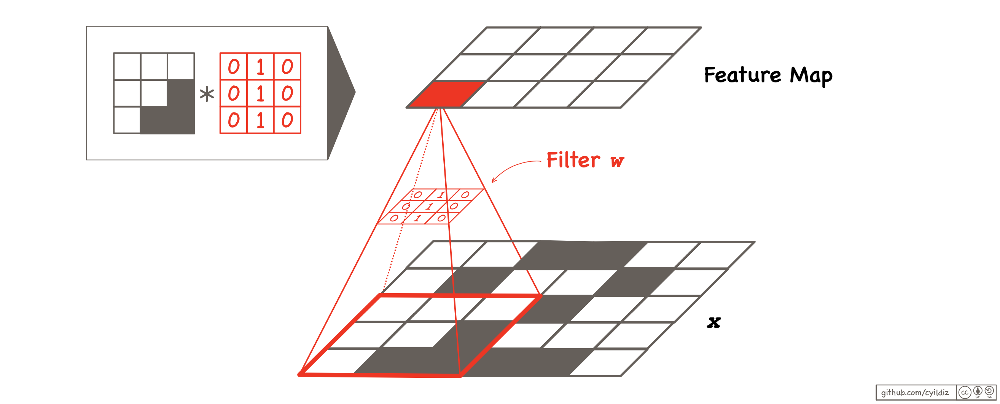
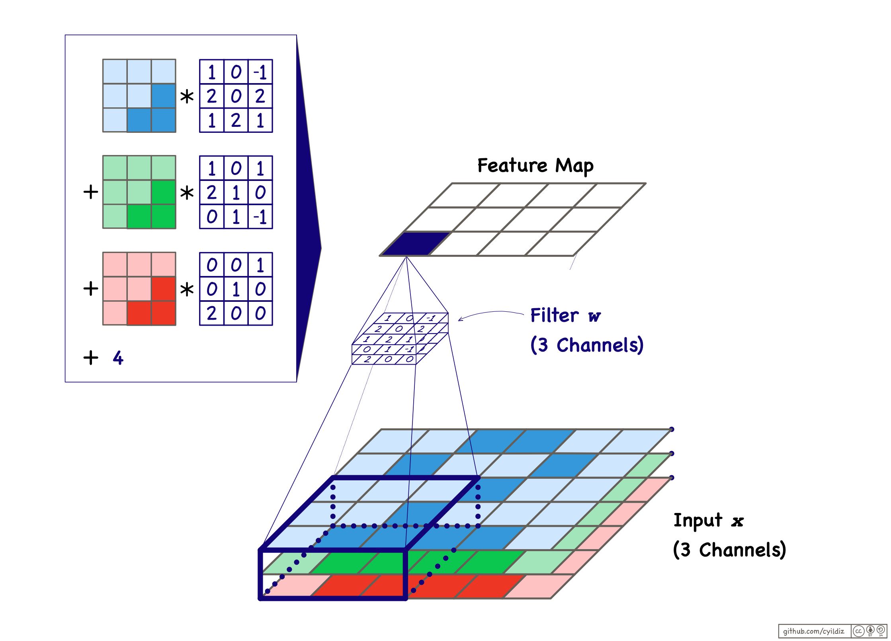
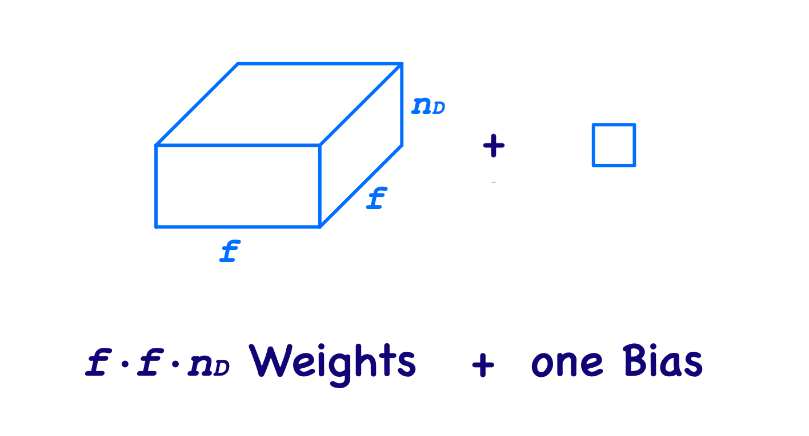
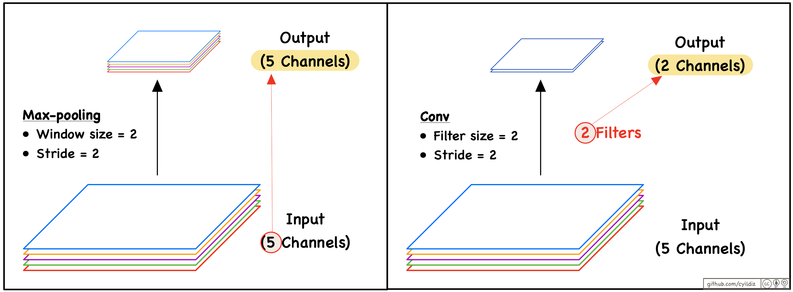
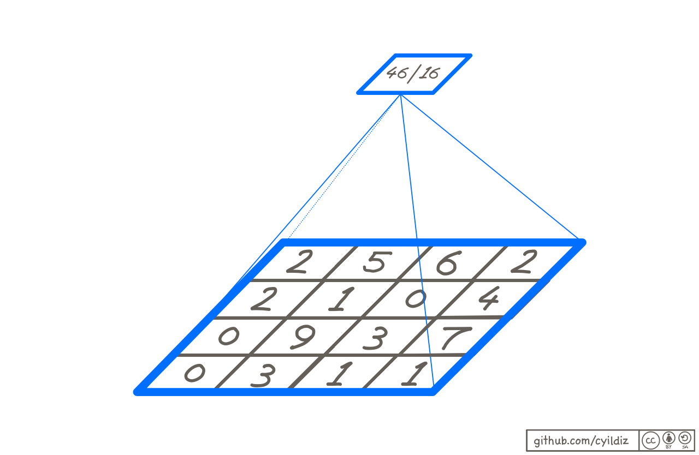

# Convolutional Katmanlar
## `Conv` hücresi versus `Dense` hücresi

### `Dense`
Bir `Dense` katmanda her bir hücre **tüm giriş hücrelerine** bağlıdır.

 

- Girdi hücreleri bir **vektör** şeklinde düzenlenmiştir.
- Ağırlıklar da bir vektör halinde düzenlenmiştir.
    - Ağırlık vektörü girdi ile **aynı şekle** sahiptir.
    - Girdi ve ağırlıklar arasındaki iç çarpım hesaplanır.

### `Conv`
Bir `Conv` katmanda her bir hücre sadece **reseptif alanı** içerisindeki az sayıda girdi hücresine bağlıdır. Aşağıdaki örnekte bu reseptif alan 3x3 lük bir karedir.

 

- Girdi nöronları **çok boyutlu bir dizide** düzenlenmiştir.
- Ağırlıklar da **filtre** adı verilen çok boyutlu bir dizide (yani tensörde) düzenlenir.
    - Ağırlık tensörü ile reseptif alan  **aynı şekle** sahiptirler. Yani **kanal sayıları** da aynıdır (bu örnekte kanal sayısı birdir).
    - Ağırlıklar tensörü ile reseptif alan arasındaki iç çarpım hesaplanır. Bu işleme **convolution / konvolüsyon** da denir ve '*' ile gösterilir.

Filtre her seferinde bir piksel olmak üzere adım adım görüntü üzerinde hareket ettirilir ve girdinin tüm 3x3 alanları ile iç çarpımı hesaplanır. Sonuç, **feature map / özellik haritası** (veya çıktı kanalı) olarak adlandırılan 3x4'lük bir matristir. 

## Zero-Padding

Çıktının girdi ile aynı boyutta olmasını istiyorsak, görüntüyü boyutlar eşleşecek şekilde sıfırlarla çevreleriz. Bu **zero-padding** veya **sıfır dolgusu** olarak adlandırılır.
Gerekli olan dolgu satır ve sütun sayısının nasıl hesaplanabileceğini daha sonra göreceğiz.

Dolgu satırları ve sütunları görüntünün üst ve alt kısımlarına ve sol ve sağ kısımlarına eşit olarak dağıtılır. Eğer sayı çift değilse, arada bir piksellik bir fark oluşabilir. 

 

## Stride

Stride, konvolüsyonel filtrenin girdi üzerinde hareket ederkenki **adım boyutunu** kontrol eden bir **hiperparametre**dir. Filtrenin reseptif alanları arasındaki uzaklığı belirler. 

Biz bundan sonrasında hem yatay hem de dikey yönde aynı adım boyutunu kullanacağız ve bunu $s$ ile göstereceğiz. 

## Filtre boyutu

- Filtrenin **Yüksekliği** ve **Genişliği** hiperparametrelerdir (örneğin 3x3 veya 5x5). Biz bundan sonrasında aynı yükseklik ve genişliğe sahip filtreler kullanacağız ve boyutu $f$ ile göstereceğiz.

- Filtrenin **derinliği** (yani kanal sayısı) girdi ile aynıdır.
    - Tüm kanallar üzerinden bir iç çarpım hesaplanır, ardından bias değeri eklenir.

 

## Çıktı boyutu

Bir `Conv` katmanı birden fazla filtreye sahip olabilir. **Filtre sayısı** bir **hiperparametre**dir. Her filtre bir feature map üretir.

Bir katmanın çıktısının **derinliği** (yani feature map sayısı), o Conv katmanında kullanılan filtre sayısına eşittir.

Çıktının **Yüksekliği** ve **Genişliği** şu şekilde hesaplanabilir

$$ n'_H=⌊\frac{n_H + p_H - f}{s}+1⌋ $$

$$ n'_W=⌊\frac{n_W + p_W - f}{s}+1⌋ $$

Burada $n_H$ ve $n_W$ girdi tensörünün yüksekliği ve genişliğidir, $p_H$ sıfır dolgu satırlarının sayısıdır (yüksekliğe eklenir) ve $p_W$ sıfır dolgu sütunlarının sayısıdır (genişliğe eklenir).

## Çıktı değerlerinin hesaplanması

$z_{i,j,k}$ çıktı değeri şu şekilde hesaplanabilir:

$$z_{i,j,k} = b_k + \sum_{u=0}^{f-1}\sum_{v=0}^{f-1}\sum_{d=0}^{n_D}x_{i\cdot s+u, j\cdot s+v, d} \cdot w_{u,v,d,k}$$

$u$ indeksi filtrenin satırları, $v$ indeksi filtrenin sütunları ve $d$ indeksi filtrenin kanalları boyunca ilerler.

## Parametre sayısı

$f$ boyutunda $n'_D$ adet filtreye sahip bir `Conv` katmanının parametre sayısı şöyledir:

$$ n'_D \cdot (f \cdot f \cdot n_D + 1) $$

$n_D$ filtrenin derinliğidir, dolayısıyla aynı zamanda girdinin derinliğidir. $1$ sayısı Bias değeri içindir (filtre başına bir bias değeri vardır).

 

  

# Pooling / Havuzlama Katmanları

Havuzlama katmanları, temel bilgileri mümkün olduğunca koruyarak özellik haritalarının boyutunu azaltmak ve böylece hesaplama yükünü ve bellek kullanımını azaltmak için kullanılır. 

İki ana havuzlama katmanı türü vardır.

## Max-Pooling katmanı

Konvolüsyonel katmana benzer şekilde, max-pooling (maximum havuzlama) katmanındaki her hücre, **reseptif alanı** içerisinde yer alan az sayıda girdi hücresine bağlıdır. Her hücre kendi reseptif alanında yer alan girdi değerlerinin **maksimum değerini** çıktı olarak döndürür. Dolayısıyla, bir havuzlama katmanında **eğitilebilir parametreler** (yani ağırlıklar ve bias değerleri) yoktur.

Konvolüsyonel katmanların aksine, bir havuzlama katmanı hücresinin reseptif alanı **tüm kanalları içermez** ; her kanal ayrı ayrı işlenir.

Bir Max-pooling katmanının iki ana **hiperparametresi** vardır:
- **Pencere boyutu** (**çekirdek boyutu** veya **havuz boyutu**): Dikdörtgensel reseptif alanın boyutunu belirler.
- **Stride / Adım**: Pencerenin girdiyi tararken attığı adımların boyutunu belirler (bu iki ardışık reseptif alan arasındaki uzaklığa denk gelir). 

Genellikle, pencere boyutu ile stride aynı olacak şekilde ayarlanır, böylece farklı hücrelerin reseptif alanları çakışmaz. Örneğin, 2'lik bir pencere boyutu ve 2'lik bir stride kullanılınca oluşan çıktı alanı, girdinin alanının dörtte biri kadar olacaktır.

 

Gerekirse çıktı boyutunu ayarlamak için girdi sıfırlarla doldurulabilir.

Konvolüsyonel katmanların aksine, bir havuzlama katmanının **her bir özellik haritasını <u>ayrı ayrı</u>** işlediğini, böylece çıktının girdiyle aynı sayıda kanala sahip olduğunu unutmayın.

 

## Average-Pooling katmanı

Average-pooling (Ortalama havuzlama) katmanı, maksimum havuzlama katmanı ile neredeyse aynıdır. Tek farkı, reseptif alandaki değerlerin ortalamasının hesaplanıyor olmasıdır.

 

## Global Average Pooling katmanı

Global Average Pooling (GAP) katmanı, pencere boyutunun feature map boyutuna eşit olduğu bir Average Pooling katmanı türüdür. Burda feature map içindeki tüm öğelerin ortalaması hesaplanır ve dolayısıyla feature map başına tek bir skaler değer elde edilir.

 

GAP çok fazla bilgi kaybına sebep olsa da, belirli senaryolarda bir CNN'in son katmanlarında faydalı olabilir. Bu katmanın çıktısı *(1,1,kanal sayısı)* şekline sahiptir; bir bakıma feature mapler kanal sayısı uzunluğunda bir vektöre düzleştirilmiş olur. Bu çıktı bir vektöre dönüştürülerek bir fully connected sınıflandırma katmanına girdi olarak verilerbilir.

Bir CNN'in daha derin katmanlarında, kanal sayısı artarken özellik haritalarının yüksekliği ve genişliği azalma eğilimindedir. Son evrişimsel katmanın çıktısı nispeten küçükse, örneğin 7x7, GAP katmanı daha az yıkıcı olacaktır.